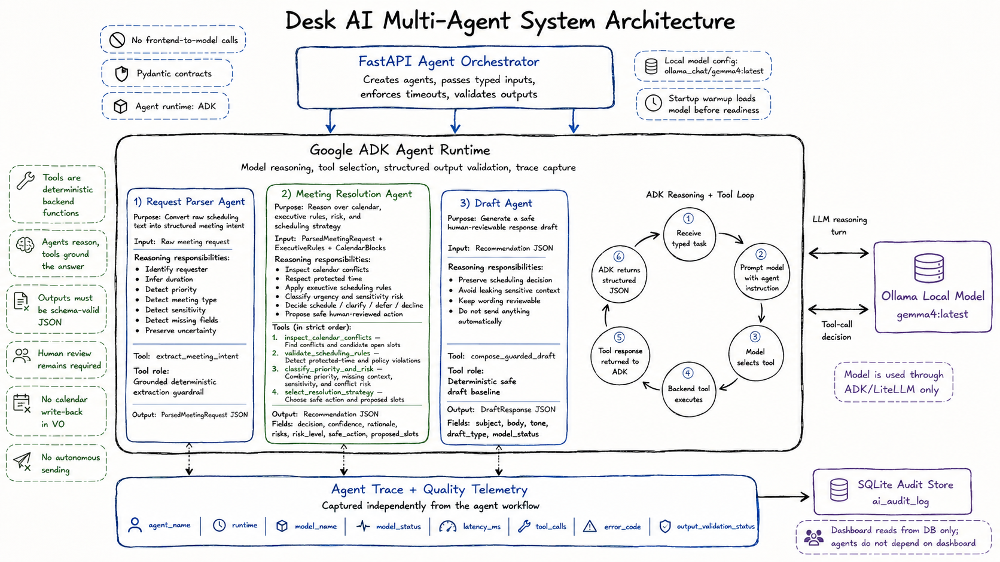

# Desk Claw

Desk Claw is a local executive operations scheduling copilot. It helps an executive assistant turn a messy inbound meeting request into a structured scheduling decision: parse the request, apply executive preferences and calendar context, generate a recommendation, draft a response, capture feedback, and log the final decision.

The current implementation lives in `executive-ops-copilot-v0/` and is built as a local web app:

- FastAPI backend for validation, orchestration, policy checks, SQLite persistence, and local Gemma/Ollama model calls.
- React, TypeScript, and Vite frontend for the scheduling workflow UI.
- JSON Schema and OpenAPI contracts for backend/frontend data shapes.
- Playwright, Vitest, pytest, and local eval cases for verification.

## System Design


## Agent Architecture



The Desk AI multi-agent layer is the backbone of the system. FastAPI owns orchestration and typed contracts, while Google ADK owns the model reasoning loop, tool selection, and trace capture. The parser, meeting-resolution, and draft agents each return validated JSON that the product can review and render safely.

Tools remain deterministic backend functions, so the agents reason over scheduling context without gaining autonomous write access. This keeps the system local-first, auditable, and human-reviewed while still using the local `gemma4:latest` model for agentic reasoning.

## Product Direction

V0 is focused on human-reviewed executive scheduling triage. The product does not send emails, create calendar invites, write to external calendars, or act autonomously. It keeps the assistant in control while making request parsing, risk review, recommendation generation, and response drafting faster and more consistent.

The intended local model runtime is Ollama with `gemma4:latest`. The frontend never calls the model directly; all model access goes through the backend so outputs can be validated before they reach the UI.

## Repository

- `executive-ops-copilot-v0/`: runnable V0 app, tests, contracts, evals, and detailed README.
- `.github/workflows/ci.yml`: GitHub Actions CI for backend, frontend, build, and E2E tests on `main`.
- `executive-ops-copilot-v0/infra/`: Docker Compose and Kubernetes deployment prep for separate frontend, backend, and Ollama services.
- `executive-ops-copilot-v0/docs/deployment-model-hosting.md`: Kubernetes model-hosting choices for in-cluster CPU, in-cluster NVIDIA GPU, and private external Ollama-compatible endpoints.
- `executive-ops-copilot-v0/docs/deployment-network-policy.md`: NetworkPolicy enforcement verification and frontend ingress isolation for public Kubernetes releases.
- `executive-ops-copilot-v0/docs/deployment-storage-policy.md`: StorageClass, PVC backup policy, and VolumeSnapshot verification path for deployment.
- `executive-ops-copilot-v0/docs/deployment-public-access.md`: public ingress access-control modes for IP allowlists and provider-gated WAF/DDoS/identity controls.
- `LICENSE`: project license.

Start with:

```bash
cd executive-ops-copilot-v0
```

Then follow the app-level README for setup, Gemma4/Ollama requirements, backend and frontend run commands, tests, and evals.
